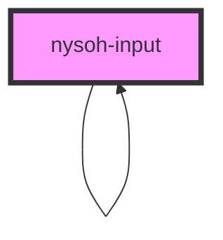

# nysoh-input

<!-- Auto Generated Below -->

## Properties

| Property      | Attribute     | Description | Type                                                                                                                                                                                                                                  | Default     |
| ------------- | ------------- | ----------- | ------------------------------------------------------------------------------------------------------------------------------------------------------------------------------------------------------------------------------------- | ----------- |
| `disabled`    | `disabled`    |             | `boolean`                                                                                                                                                                                                                             | `undefined` |
| `placeholder` | `placeholder` |             | `string`                                                                                                                                                                                                                              | `undefined` |
| `type`        | `type`        |             | `"button" \| "checkbox" \| "color" \| "date" \| "datetime-local" \| "email" \| "file" \| "hidden" \| "image" \| "month" \| "number" \| "password" \| "range" \| "search" \| "submit" \| "tel" \| "text" \| "time" \| "url" \| "week"` | `'text'`    |
| `value`       | `value`       |             | `string`                                                                                                                                                                                                                              | `undefined` |

## Dependencies

### Used by

 - [nysoh-input](.)

### Depends on

- [nysoh-input](.)

### Graph

----------------------------------------------

*Built with [StencilJS](https://stenciljs.com/)*
